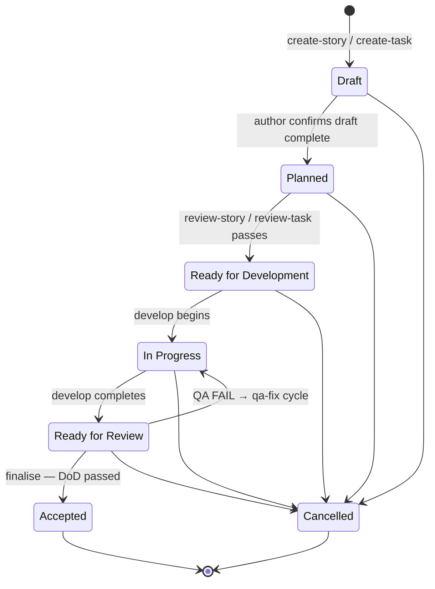

<!-- AUTO-GENERATED — DO NOT EDIT. Source: shared/resources/document-status-lifecycle.md. Regenerate via `npm run bundle`. -->

# Document Status Lifecycle

This is the single source of truth for document status values across all story and task documents. Every skill that reads or writes a `status` field references this file.

---

## Canonical Lifecycle

```
Draft → Planned → Ready for Development → In Progress → Ready for Review → Accepted
```

`Cancelled` is reachable from any non-terminal state. Terminal states are **Accepted** and **Cancelled**.

The QA loop introduces a backward edge: `Ready for Review → In Progress` (QA FAIL → qa-fix → re-submit).

---

## State Machine Diagram



---

## Status Reference Table

| Frontmatter value       | Body label              | Set by                        | Preconditions                                                |
| ----------------------- | ----------------------- | ----------------------------- | ------------------------------------------------------------ |
| `draft`                 | `Draft`                 | `create-story`, `create-task` | None — initial state                                         |
| `planned`               | `Planned`               | `create-task` (tasks only)    | Author confirms draft complete                               |
| `ready-for-development` | `Ready for Development` | `review-story`, `review-task` | Review passes (≥8/10, 0 critical issues)                     |
| `in-progress`           | `In Progress`           | `develop`                     | Status was `ready-for-development` or `in-progress` (resume) |
| `ready-for-review`      | `Ready for Review`      | `develop` (completion)        | All implementation plan phases / tasks checked off           |
| `accepted`              | `Accepted`              | `finalise`                    | DoD checklist passed, QA gate PASS or WAIVED                 |
| `cancelled`             | `Cancelled`             | Any skill / human             | Manual decision — no automated transition                    |

### Deprecated synonyms (do not use in new skills)

| Deprecated value | Canonical replacement                      | Notes                                                                           |
| ---------------- | ------------------------------------------ | ------------------------------------------------------------------------------- |
| `Ready for QA`   | `Ready for Review`                         | Used in older qa-task versions; retire in follow-up task                        |
| `📋 Planned`     | `planned` (frontmatter) / `Planned` (body) | Emoji prefix in legacy docs; do not write in new skills                         |
| `ready-for-dev`  | `ready-for-development`                    | Shortened form found in create-task / create-story; normalise on next touch     |
| `Completed`      | `Accepted`                                 | qa-task used this for gate PASS; canonical is `accepted` / `Accepted`           |
| `Ready for Done` | `Ready for Review`                         | qa-story used this as an intermediate gate result. ⚠️ The replacement is **`Ready for Review`, not `Accepted`** — qa-story runs *before* `finalise`, so mapping it to the terminal state would announce acceptance before the DoD check that can refuse it. Corrected 2026-08-26 after the original mapping was found to trade a lint failure for a worse defect |

---

## Frontmatter vs Body Sync Rule

**Rule**: every time a status changes, **both** locations must be updated in the same edit.

| Location              | Format                         | Example                         |
| --------------------- | ------------------------------ | ------------------------------- |
| Frontmatter `status:` | lowercase kebab-case, no emoji | `status: ready-for-development` |
| Body `Status:`        | Title Case, no emoji           | `Status: Ready for Development` |

The body `Status:` line lives in the document's metadata block, typically the second line after the frontmatter delimiter or the first line of a metadata table.

**Enforcement**: the `finalise` skill checks both fields and fails the DoD checklist if they are out of sync.

### Worked Example 1 — develop completes

Before (frontmatter + body):

```yaml
status: in-progress
```

```markdown
**Status:** In Progress
```

After:

```yaml
status: ready-for-review
```

```markdown
**Status:** Ready for Review
```

Both lines change in the same commit.

### Worked Example 2 — finalise accepts

Before:

```yaml
status: ready-for-review
```

```markdown
**Status:** Ready for Review
```

After:

```yaml
status: accepted
```

```markdown
**Status:** Accepted
```

Both lines change in the same commit.

---

## Who Reads and Writes Each Value

| Status                  | Writer skill                  | Reader skills                                               |
| ----------------------- | ----------------------------- | ----------------------------------------------------------- |
| `draft`                 | `create-story`, `create-task` | `review-story`, `review-task`, `develop`                    |
| `planned`               | `create-task`, human author   | `review-task`, `develop`                                    |
| `ready-for-development` | `review-story`, `review-task` | `develop`, `develop-story`, `develop-task` (pipeline gate)  |
| `in-progress`           | `develop`                     | `review-story`, `review-task` (skip review gate), `qa-task` |
| `ready-for-review`      | `develop`                     | `qa-task`, `qa-story`, `finalise`                           |
| `accepted`              | `finalise`                    | `scrum-master`, reporting tools                             |
| `cancelled`             | Human / any skill             | All skills (treat as terminal — no further transitions)     |

---

## External Tracker Mapping (Jira)

These statuses are the **local** vocabulary. When a document is synced to Jira, the
`sync-jira-{story,task,epic}` skills translate the local status to a Jira workflow status name and
transition the issue to match.

Default mapping (vanilla Jira workflow):

| Local status                                | Default Jira status |
| ------------------------------------------- | ------------------- |
| `draft`, `planned`, `ready-for-development` | `To Do`             |
| `in-progress`                               | `In Progress`       |
| `ready-for-review`                          | `In Review`         |
| `accepted`                                  | `Done`              |
| `cancelled`                                 | `Cancelled`         |

> **Pipeline stages are a different vocabulary.** The statuses above are the words a _document_
> uses. The develop pipeline also signals **stages** — `work-started`, `in-review`, `in-qa`,
> `ready-for-merge`, `blocked`, `done` — which are points in a _run_, configured separately via the
> workflow record. They are a superset, not a replacement: `in-qa` and `ready-for-merge` name board
> columns no document status has ever named, and `draft` / `planned` name document states the
> pipeline never signals. Nothing here changes when a stage is enabled. See
> [Pipeline stages](https://github.com/Gamaroff/agent-skills/blob/develop/docs/reference/configuration.md#pipeline-stages).

Projects whose Jira workflow uses different status names (e.g. "Selected for Development") override the
mapping under `jira.statusMap` in `skills-config.yaml`. See [Jira status mapping](https://github.com/Gamaroff/agent-skills/blob/develop/docs/reference/configuration.md#jira-status-mapping) for the full reference. Matching is by name only — see [`jira-transition-protocol.md`](jira-transition-protocol.md).

---

## Allow-List Validation

Run this snippet to verify every `status:` value written by skills is in the canonical allow-list:

```bash
#!/usr/bin/env bash
# Extract all status values written by skills and assert against the allow-list.
ALLOW=(draft planned ready-for-development in-progress ready-for-review accepted cancelled)

VALUES=$(grep -rhnE "status: ['\"]?([a-z][a-z -]+)" skills/ \
  | grep -oE "'[^']+'" \
  | tr -d "'" \
  | sort -u)

FAIL=0
while IFS= read -r val; do
  found=0
  for allowed in "${ALLOW[@]}"; do
    [ "$val" = "$allowed" ] && found=1 && break
  done
  [ $found -eq 0 ] && echo "UNKNOWN STATUS: '$val'" && FAIL=1
done <<< "$VALUES"

[ $FAIL -eq 0 ] && echo "All status values are canonical." || exit 1
```

> Note: this grep targets lowercase values only (frontmatter). Body Title-Case values are intentionally excluded — they map 1-to-1 to the frontmatter values above.
