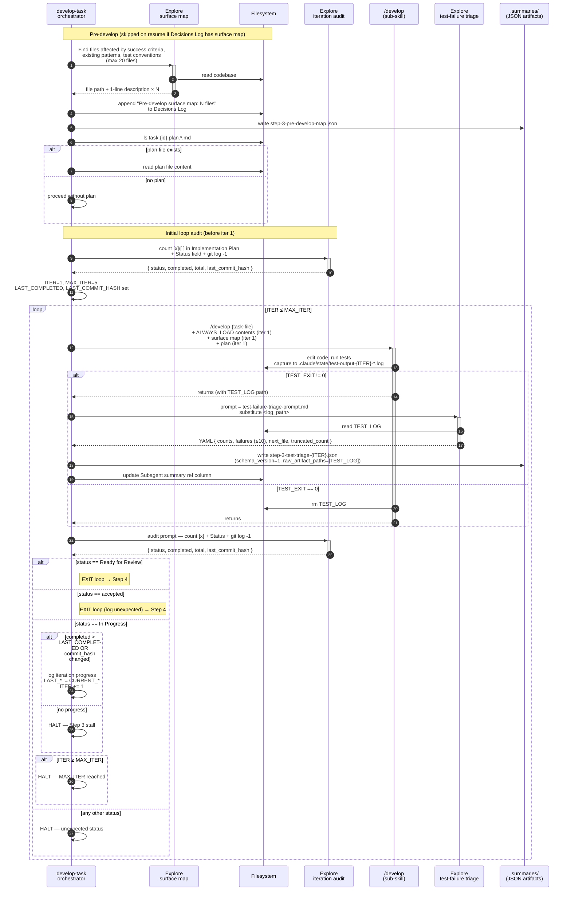
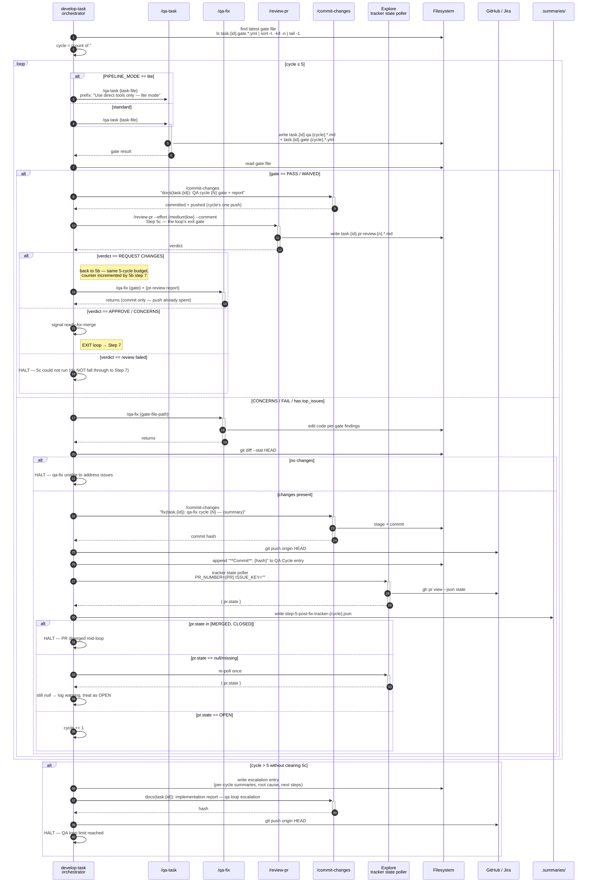
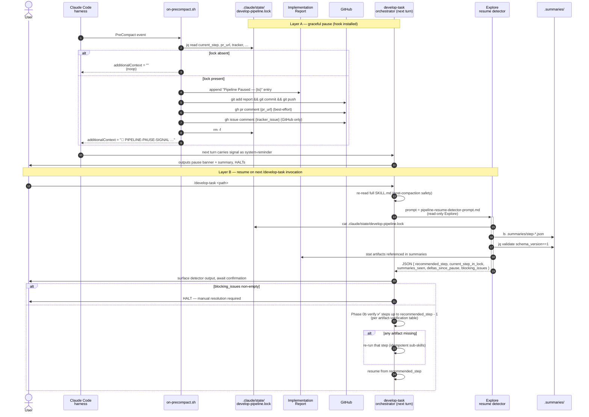

# `develop-task` — Harness, Subagents & Sub-Skill Interaction

Comprehensive reference for the `develop-task` 8-step pipeline. Reflects the orchestrator at `skills/develop-task/SKILL.md` plus the `develop-pipeline-*.md` protocol files in the `shared/resources/` directory that define each phase, the resume contract, the graceful-pause hook, and the subagent prompts.

This document is structured for two audiences:

1. **Humans** maintaining the harness — the diagrams and tables show every fork point, every subagent dispatch, and every lock/artifact mutation.
2. **Evals** — each subagent contract row and each artifact-lifecycle row is meant to anchor a future assertion (input shape, output schema, persistence path, failure semantics).

---

## Technical Summary

`develop-task` is a thin **orchestrator** for standalone technical tasks (refactoring, infra, cleanup). Almost all real logic lives in `develop-pipeline-*.md` files under `shared/resources/`, loaded on demand per step (progressive disclosure). It coordinates 8 sub-skills sequentially and maintains a co-located **implementation report** as the durable source of truth for state and audit trail. Tasks live in `docs/tasks/task.{id}.{name}/`.

### External touchpoints

| Surface                  | Operations                                                                                                                                                                                                                                                                                                                           |
| ------------------------ | ------------------------------------------------------------------------------------------------------------------------------------------------------------------------------------------------------------------------------------------------------------------------------------------------------------------------------------ |
| **Filesystem**           | task file (read/append `[x]`), implementation report (`task.{id}.implementation.{N}.*.md`), review report, plan file, gate file (`.yml`), QA report, DoD summary, lock file `.claude/state/develop-pipeline.lock`, subagent summaries `<task-dir>/.summaries/step-*.json`, test-output logs `.claude/state/test-output-{ITER}-*.log` |
| **Git**                  | branch create, stash/pop, commits via `/commit-changes` only, `git push origin HEAD` after every QA cycle + final, mtime + `git log -1` audits                                                                                                                                                                                       |
| **GitHub**               | `gh issue comment/close/view`, `gh pr view/comment`, board moves via `gh-stage.js --stage <moment>` (columns resolved from `tracker-workflow.yaml`; Priority auto-set inline), PR creation via `/create-pr`                                                                                                                                                                       |
| **Jira**                 | `tracker-comment.js`, status moves via `jira-stage.js --stage <moment>` (columns resolved from `tracker-workflow.yaml`). Atlassian MCP (`getTransitionsForJiraIssue`, `transitionJiraIssue`, `getJiraIssue`) is the **fallback only**, used when the CLI reports `no-credentials`                                                                                                                                                                                                        |
| **Subagents (Explore)**  | resolver, tracker state poller, lite-mode + always-load detector, pipeline-resume stale-context detector, pre-develop surface map, initial loop audit, per-iteration loop audit, test-failure triage, post-fix tracker state poller                                                                                                  |
| **Hooks**                | `PreCompact` → `scripts/on-precompact.sh` (graceful pause: report append, commit, push, PR/issue comment, lock removal, `🛑 PIPELINE-PAUSE-SIGNAL` emission)                                                                                                                                                                         |

### State changes

- **Files created**: feature branch, implementation report, lock file, review report, plan file (optional), gate `.yml`, QA report, DoD summary file, PR, `.summaries/step-*.json` artifacts, test-output logs (transient)
- **Files mutated**: task file (status frontmatter, `[x]` ticks), implementation report (Pipeline Progress + `Subagent summary ref` column, Decisions Log, Issues Log, QA Iteration History), lock file (`current_step`, `pr_url`)
- **Tracker fields**: GitHub issue state (open→closed), Projects v2 board driven by `gh-stage.js` (the column for each moment comes from the consumer's `tracker-workflow.yaml`, not a hardcoded name; backward moves refuse with `would-regress`), Priority auto-set to P2 when unset; Jira `status` transitions + comments
- **Git refs**: feature branch HEAD, remote branch (push after every QA cycle), PR HEAD

### Notable design choices

- All commits go through `/commit-changes` (never raw `git commit`) → consistent Conventional Commits.
- Gate files are read-only to dev skills; only QA skills mutate them.
- Step banners + lock `current_step` updates create checkpoints that survive context compression.
- Resume verifies each ✅ step's _artifact_ on disk — does not trust the report alone. The stale-context detector subagent narrows the verification scope so resume is fast.
- `review-task` auto-answers "apply all critical + important fixes" and "yes, fixes complete" in pipeline mode — task must be `Ready for Development` before Step 3 runs.
- Test logs are **never read into main context** — only the triage subagent's structured summary is consumed.
- Phase 0 fan-out dispatches 3 Explore subagents in a single message — sequential dispatch is forbidden (drift guard added in task.31).
- Subagent summaries are persisted as JSON under `.summaries/` so main context can release verbose subagent output and resume can replay without re-dispatching.
- **Phase 0d prompts the user** for base branch (Q1, default = `develop` or current `feature/*`) and PR target (Q2, default = `develop`). Auto-derived value is the recommended/first option, never silent. qa-planning is always silently skipped (no Q3).
- **Tracker "Work Started" signal fires after Step 1**, not in Phase 0c-reg. The signal is defined in step-0 but invoked from step-1 §"Signal Work Started" so a failed branch creation does not leave the tracker stuck `In Progress`.
- **qa-fix commits exclude the implementation report** — the report is unstaged before each `/commit-changes` in cycle. Step 8 owns the sole report commit (`docs(...)`).

### Compared to `develop-story`

- **No QA traceability mapper subagent.** `develop-story` runs a traceability mapper before `/qa-story` in standard mode (Step 5 pre-step); `develop-task` invokes `/qa-task` directly.
- **No epic-branch concept.** Both `develop-task` and `develop-story` Q1 prompt for the base branch with `develop` as the recommended option; neither creates or targets an epic branch.
- All other subagent dispatches and the full 8-step skeleton are identical — both share the same shared/resources protocol files.

---

## Mermaid Theme (shared by all diagrams below)

See `references/develop-pipeline-readme-mermaid-theme.md` for the canonical theme init block and the semicolon caveat. Both `develop-story` and `develop-task` README diagrams share this theme — update it there, not here.

---

## Diagram 1 — Top-Level Pipeline Flow

Pipeline state machine. Branches show every halt path and every loop bound.

```mermaid
flowchart TD
    U([User: /develop-task &lt;path&gt;]) --> P0[Phase 0: Resolve & Prepare]

    P0 --> P0a[0a inline resolution<br/>URL/Jira-key/file/dir]
    P0a --> P0p{Lock file exists?}
    P0p -- yes --> RES[Phase 0a: Resume detector subagent]
    P0p -- no --> FAN[Phase 0a-parallel fan-out:<br/>resolver + tracker poller + lite-mode detector]
    RES --> RESblock{blocking_issues<br/>non-empty?}
    RESblock -- yes --> HALT0[HALT: manual resolution required]
    RESblock -- no --> P0b[Phase 0b: artifact verification<br/>up to recommended_step - 1]
    P0b --> S1
    FAN --> P0c[0c read doc + status check]
    P0c --> P0load[0c-load resolve ALWAYS_LOAD_FILES]
    P0load --> P0d[0d AskUserQuestion:<br/>Q1 base + Q2 PR target<br/>recommended = develop / current feature]
    P0d --> P0e[0e create implementation report]
    P0e --> P0f[0f preflight summary]
    P0f --> S1[Step 1: create-branch]

    S1 --> S1lock[(write lock<br/>current_step=1)]
    S1lock --> S1reg[Step 1 post: signal Work Started<br/>tracker In Progress + board move<br/>relocated from Phase 0c-reg]
    S1reg --> S2[Step 2: review-task]
    S2 --> S2out{Outcome}
    S2out -- READY TO IMPLEMENT --> S3
    S2out -- NEEDS REVISION --> HALT2[HALT: surface findings]
    S2out -- REQUIRES REWORK --> HALT2

    S3[Step 3: develop loop<br/>MAX_ITER=5] --> S3pre[Pre-develop:<br/>surface map subagent +<br/>plan file discovery]
    S3pre --> S3init[Initial loop audit subagent<br/>INITIAL_COMPLETED, M, LAST_COMMIT_HASH]
    S3init --> S3body
    S3body[Invoke /develop<br/>with always-load + map + plan] --> S3test{Tests run?}
    S3test -- TEST_EXIT != 0 --> S3triage[Test-failure triage subagent]
    S3triage --> S3audit
    S3test -- TEST_EXIT == 0 --> S3audit[Iteration audit subagent]
    S3audit --> S3branch{audit.status}
    S3branch -- Ready for Review --> S4
    S3branch -- accepted --> S4
    S3branch -- In Progress --> S3prog{Progress?<br/>completed++ OR new commit}
    S3branch -- other --> HALT3[HALT: unexpected status]
    S3prog -- no --> HALTSTALL[HALT: stall]
    S3prog -- yes --> S3iter{ITER &lt; MAX_ITER?}
    S3iter -- no --> HALTMAX[HALT: MAX_ITER reached]
    S3iter -- yes --> S3body

    S4[Step 4: create-pr<br/>--base / --issue / --exclude report] --> S5
    S5[Step 5: qa-task<br/>lite directive if PIPELINE_MODE=lite]
    S5 --> S5gate{Gate result}
    S5gate -- PASS / WAIVED --> S5c[Step 5c: review-pr<br/>--effort medium, low if lite<br/>--comment]
    S5gate -- CONCERNS / FAIL --> S6[Step 6: qa-fix]
    S5c --> S5cv{Verdict}
    S5cv -- REQUEST CHANGES<br/>commit only, push already spent --> S6
    S5cv -- APPROVE / CONCERNS --> S5cm[signal ready-for-merge] --> S7
    S6 --> S6chg{Code changed?}
    S6chg -- no --> HALTNOFIX[HALT: qa-fix made no changes]
    S6chg -- yes --> S6commit[/commit-changes + push/]
    S6commit --> S6poll[Post-fix tracker state poller subagent]
    S6poll --> S6prc{PR open?}
    S6prc -- merged/closed --> HALTPR[HALT: PR state diverged]
    S6prc -- open --> S6cyc{cycle &lt; 5?}
    S6cyc -- yes --> S5
    S6cyc -- no --> HALTQA[HALT: QA loop limit reached]

    S7[Step 7: finalise<br/>DoD + tracker close + board Done] --> S7chk{All 3 artifacts?<br/>dod.N.md + status:accepted + PR comment}
    S7chk -- no --> HALT7[HALT: DoD gaps]
    S7chk -- yes --> S8
    S8[Step 8: commit-changes<br/>final report + push + remove lock] --> DONE([✅ Pipeline Complete])

    classDef halt fill:#7f1d1d,stroke:#fca5a5,color:#fef2f2
    class HALT0,HALT2,HALT3,HALTSTALL,HALTMAX,HALTNOFIX,HALTPR,HALTQA,HALT7 halt
    classDef subagent fill:#1e3a8a,stroke:#93c5fd,color:#eff6ff
    class RES,FAN,S3pre,S3init,S3triage,S3audit,S6poll subagent
```

---

## Diagram 2 — Phase 0a Parallel Fan-out (Single Message Dispatch)

Three Explore subagents dispatched in **one** assistant message. Sequential dispatch is forbidden — a drift guard test (added in task.31) asserts the orchestrator emits all three agent calls in a single tool batch.

```mermaid
sequenceDiagram
    autonumber
    actor U as User
    participant H as develop-task<br/>orchestrator
    participant A1 as Explore<br/>resolver
    participant A2 as Explore<br/>tracker poller
    participant A3 as Explore<br/>lite-mode +<br/>always-load detector
    participant FS as Filesystem
    participant GH as GitHub / Jira

    U->>H: /develop-task <input>
    H->>H: 0a inline resolve<br/>(URL / Jira-key shortcut)

    note over H,A3: Single-message dispatch (par block)<br/>Skip resolver if input was inline-resolved
    par
        H->>+A1: Find task file matching task.{id}.*.md<br/>under docs/, exclude .qa/.gate/.bug/.implementation
        A1->>FS: glob + filter
        FS-->>A1: candidate paths
        A1-->>-H: { absolute_file_path, task_directory, task_id }
    and
        H->>+A2: tracker-state-poller-subagent.md<br/>PR_NUMBER="" ISSUE_KEY={...}
        A2->>GH: gh issue view / Jira getJiraIssue
        GH-->>A2: state, labels, board status
        A2-->>-H: compact JSON (state, pr_num, errors)
    and
        H->>+A3: read doc + skills-config.yaml<br/>evaluate 3 lite conditions
        A3->>FS: read frontmatter + body
        A3->>FS: read skills-config.yaml
        FS-->>A3: contents
        A3-->>-H: { pipeline_mode, always_load_files,<br/>skills_config_exists, risk_level, ... }
    end

    note over H: Aggregate:<br/>TASK_FILE = A1.absolute_file_path<br/>PIPELINE_MODE = A3.pipeline_mode (default standard)<br/>ALWAYS_LOAD_FILES = A3.always_load_files (default [])<br/>TRACKER_STATE = A2

    H->>FS: append Decisions Log<br/>"Lite mode: {value}, always-load: {N} files"

    alt A1 fails
        H->>U: HALT — file not found
    else A2 fails
        H->>FS: log warning, set tracker fields null
    else A3 fails
        H->>FS: default PIPELINE_MODE=standard, ALWAYS_LOAD_FILES=[]
    end
```

---

## Diagram 3 — Step 3 Develop Loop (with Test-Failure Triage)

The develop loop is bounded by `MAX_ITER=5` and a stall guard. Tests fail → triage subagent classifies → main reads only the structured summary. Raw test logs never enter main context.

---

## Diagram 4 — Steps 5–6 QA Loop

QA cycle counter capped at 5. Lite mode skips parallel agents inside `/qa-task`. Post-fix poller checks PR state to detect mid-loop merge/close.

---

## Diagram 5 — Resume & Pause Flow (Two Layers)

Layer A is the **graceful pause** path (PreCompact hook, requires installation). Layer B is the **mandatory post-compaction recovery** path (works even without the hook). Both converge on Phase 0b artifact verification.

---

## Subagent Contract Table (Eval Anchor)

Every Explore subagent dispatched by `develop-task`. Each row is meant to anchor an output-schema assertion in the eval suite.

| #   | Subagent                                   | Dispatch point                                                           | Input prompt source                                                                                                                                                                                                  | Output schema (key fields)                                                                                                                                                                                   | Persistence                                                               | Failure semantics                                                                           |
| --- | ------------------------------------------ | ------------------------------------------------------------------------ | -------------------------------------------------------------------------------------------------------------------------------------------------------------------------------------------------------------------- | ------------------------------------------------------------------------------------------------------------------------------------------------------------------------------------------------------------ | ------------------------------------------------------------------------- | ------------------------------------------------------------------------------------------- |
| 1   | **Resolver**                               | Phase 0a-parallel (file/dir/bare-filename inputs only)                   | inline prompt in `develop-pipeline-step-0-resolve-and-prepare.md` §0a-parallel Agent 1                                                                                                                               | `{ absolute_file_path: string, task_directory: string, task_id: string }` or `{ error: string }`                                                                                                             | none (in-memory only)                                                     | HALT — cannot continue without file path                                                    |
| 2   | **Tracker state poller**                   | Phase 0a-parallel + Step 5b post-fix                                     | `references/tracker-state-poller-subagent.md`                                                                                                                                                                        | compact JSON `{ pr: { state, number }, issue: { state, labels, board_status }, errors: [] }`                                                                                                                 | optional `step-5-post-fix-tracker.json` (Step 5b)                         | log warning, set fields null, continue (non-blocking)                                       |
| 3   | **Lite-mode + always-load detector**       | Phase 0a-parallel                                                        | inline prompt in step-0 §0a-parallel Agent 3. Sets `pipeline_mode=lite` only when **all three** are true: (a) `risk_level ∈ {low, absent}`, (b) `phase_count ≤ 2`, (c) `single_module = true`. Any false ⇒ standard. | `{ risk_level: low\|medium\|high\|absent, phase_count: int, single_module: bool, pipeline_mode: lite\|standard, skills_config_exists: bool, always_load_files: string[], has_success_criteria_table: bool }` | none                                                                      | log warning, default `pipeline_mode=standard`, `always_load_files=[]`                       |
| 4   | **Pipeline-resume stale-context detector** | Phase 0a (resume only — when lock exists)                                | `references/pipeline-resume-detector-prompt.md`                                                                                                                                                                      | `{ schema_version: 1, recommended_step: int, current_step_in_lock: int, summaries_seen: string[], deltas_since_pause: object[], blocking_issues: string[] }`                                                 | none (transient)                                                          | invalid JSON → fall back to full Phase 0b verification using `current_step` as upper bound  |
| 5   | **Pre-develop surface map**                | Step 3 pre-develop (skipped on resume if Decisions Log has cached entry) | inline prompt in `develop-pipeline-step-3-develop-loop.md` "Pre-develop Codebase Mapping"                                                                                                                            | unstructured: `<path> — <1-line description>` × N (max 20)                                                                                                                                                   | `step-3-pre-develop-map.json` (per `subagent-summary-artifact.md` schema) | log warning, proceed without surface map                                                    |
| 6   | **Initial loop audit**                     | Step 3, before iteration 1                                               | `references/loop-audit-prompt.md` (substitute `<DOC_TYPE>=task`, `<TASKS_SECTION>=## Implementation Plan`)                                                                                                           | JSON `{ status: string, completed: int, total: int, last_commit_hash: string }`                                                                                                                              | `step-3-iteration-audit-0.json`                                           | retry once on JSON parse failure; then inline shell fallback (`grep -cE '\[x\]'`)           |
| 7   | **Per-iteration loop audit**               | Step 3, after every `/develop` return                                    | `references/loop-audit-prompt.md` (same substitutions as #6)                                                                                                                                                         | same as #6                                                                                                                                                                                                   | `step-3-iteration-audit-{ITER}.json`                                      | retry once; on second failure HALT with "Audit JSON parse failure"                          |
| 8   | **Test-failure triage**                    | Step 3 develop loop, on `TEST_EXIT != 0`                                 | `references/test-failure-triage-prompt.md`                                                                                                                                                                           | YAML `{ counts: {real, flaky, unrelated}, failures: [{ name, classification, file, line, reason }] (≤10), next_file: string, truncated_count: int, cap: 10 }`                                                | `step-3-test-triage-{ITER}.json` with `raw_artifact_paths: [<test-log>]`  | bias rule: "if unsure between real and flaky, classify as real" — agent always returns YAML |

### Bias / canon rules cross-reference

- `test-failure-triage`: **bias rule** — when unsure between `real` and `flaky`, classify as `real`. Eval target: failure-classification regression suite.
- `lite-mode detector`: all three conditions must be true; any `false` ⇒ `pipeline_mode=standard`.
- `resume detector`: summary-exempt steps `[1, 2, 4, 8]` are never treated as gaps. Eval target: gap-detection unit tests.
- All Explore subagents: **read-only** — no writes, no git mutations beyond `git branch --list` / `git log`.

---

## Artifact Lifecycle Table (Eval Anchor)

Every file the harness creates or mutates, with its lifecycle. Anchor for "did the pipeline produce the expected artifacts?" evals.

| Artifact                 | Path pattern                                    | Created by                                                               | Mutated by                                                                                                                 | Terminal state                                  | Resume verification                                                                                          |
| ------------------------ | ----------------------------------------------- | ------------------------------------------------------------------------ | -------------------------------------------------------------------------------------------------------------------------- | ----------------------------------------------- | ------------------------------------------------------------------------------------------------------------ |
| Pipeline lock            | `.claude/state/develop-pipeline.lock`           | Step 1 (end of)                                                          | Steps 2–8 banners (`current_step`), Step 4 (`pr_url`), PreCompact hook (rm), Step 8 (rm), terminal HALT (snapshot then rm) | absent at Step 8 success or HALT                | `cat ... \| jq` — read by resume detector                                                                    |
| Halt snapshot            | `.claude/state/develop-pipeline.last-halt.json` | terminal HALT (snapshot of lock + `halted_at`/`halt_reason`/`halt_step`) | overwritten on subsequent terminal HALT; deleted by user choosing "Start fresh" on resume                                  | persists until next resume choice               | resume detector reads when active lock absent (`source: "halt_snapshot"`)                                    |
| Implementation report    | `task.{id}.implementation.{N}.{name}.md`        | Phase 0e                                                                 | every step (Pipeline Progress, Decisions Log, Issues Log, QA Iteration History, Subagent summary ref)                      | committed in Step 8                             | read for resume + last ✅ step                                                                               |
| Feature branch           | `feature/task.{id}.*`                           | Step 1 via `/create-branch`                                              | dev commits, qa-fix commits, final commit                                                                                  | pushed in Step 8                                | `git branch --list`                                                                                          |
| Review report            | `task.{id}.review.{YYYY-MM-DD}.md`              | Step 2 via `/review-task`                                                | —                                                                                                                          | committed in Step 8                             | optional (only if review ran)                                                                                |
| Plan file                | `task.{id}.plan.*.md`                           | upstream (created by `/plan` or manual)                                  | —                                                                                                                          | unchanged by pipeline                           | mtime check vs task file (Plan Freshness)                                                                    |
| Pre-develop summary      | `.summaries/step-3-pre-develop-map.json`        | Step 3 pre-develop                                                       | —                                                                                                                          | retained on disk (gitignored)                   | replayed instead of re-dispatching subagent                                                                  |
| Test-output log          | `.claude/state/test-output-{ITER}-*.log`        | `/develop` inside Step 3                                                 | triage subagent reads                                                                                                      | `rm -f` on `TEST_EXIT==0`; retained on failure  | none (transient)                                                                                             |
| Test-triage summary      | `.summaries/step-3-test-triage-{ITER}.json`     | Step 3, on test failure                                                  | —                                                                                                                          | retained on disk                                | replayed                                                                                                     |
| QA report                | `task.{id}.qa.{N}.{name}.md`                    | Step 5 via `/qa-task`                                                    | —                                                                                                                          | committed in Step 8                             | resume requires both qa.N.md AND gate.N.yml AND PR comment for cycle N to be ✅                              |
| Gate file                | `task.{id}.gate.{N}.{name}.yml`                 | Step 5 via `/qa-task`                                                    | only QA skills (read-only to dev)                                                                                          | committed in Step 8                             | latest gate sorted by `-t. -k4 -n`                                                                           |
| QA traceability matrix   | (not produced by `develop-task`)                | —                                                                        | —                                                                                                                          | —                                               | — (this subagent is `develop-story`-only)                                                                    |
| Post-fix tracker summary | `.summaries/step-5-post-fix-tracker-{N}.json`   | Step 5b after every qa-fix push (one file per cycle N)                   | —                                                                                                                          | retained on disk (per cycle, never overwritten) | replayed                                                                                                     |
| DoD summary              | `task.{id}.dod.{N}.{name}.md`                   | Step 7 via `/finalise`                                                   | —                                                                                                                          | committed in Step 8                             | required for ✅; `grep -iE '^status:\s*accepted'` on task file + `gh pr view --comments \| grep -i accepted` |
| PR                       | github.com/.../pull/{N}                         | Step 4 via `/create-pr`                                                  | qa-fix pushes, finalise comment                                                                                            | merged manually post-pipeline                   | `gh pr view --json state`                                                                                    |

`.summaries/` is gitignored — these are runtime-local artifacts. Resume tolerates absence (in-flight pipelines started before the convention existed).

---

## Tracker Integration

### GitHub (default — when `JIRA_URL` is unset)

Every board move goes through a **moment** — a named point in the pipeline — resolved to a column by the consumer's `tracker-workflow.yaml`. No step file names a status literal. Full spec: [`docs/reference/tracker-workflow.md`](../../docs/reference/tracker-workflow.md).

| Pipeline event                 | Moment              | Operation                                                                                                                                                                                   |
| ------------------------------ | ------------------- | ------------------------------------------------------------------------------------------------------------------------------------------------------------------------------------------- |
| Step 1 (Work Started)          | `work-started`      | `gh issue comment` ("Pipeline started — branch:") + `gh-stage.js --stage work-started --add-to-board` (board membership ensured, landed option re-read by the CLI) + Priority → P2 if unset |
| Step 4 (PR opened)             | `in-review`         | `/create-pr` passes `--issue {N}` + `gh-stage.js --stage in-review`                                                                                                                         |
| Step 5 (QA start)              | `in-qa`             | `gh-stage.js --stage in-qa` — **once**, not per cycle. *Off by default.*                                                                                                                     |
| Step 5b (entering a fix cycle) | `changes-requested` | `gh-stage.js --stage changes-requested` — **per cycle**, because it marks a state the card re-enters. *Off by default.*                                                                      |
| Step 5c (APPROVE / CONCERNS)   | `ready-for-merge`   | `gh-stage.js --stage ready-for-merge`. *Off by default.*                                                                                                                                     |
| Step 5b (post qa-fix push)     | —                   | tracker state poller checks `pr.state` is OPEN                                                                                                                                              |
| Step 7 (finalise)              | `done`              | `gh issue close {N}` + `gh-stage.js --stage done` + DoD body posted as PR comment                                                                                                            |
| Terminal HALT                  | `blocked`           | `gh-stage.js --stage blocked` — only for a real blockage, never an interruption. *Off by default.*                                                                                           |
| After the PR merges            | `pr-merged`         | Fired by `/develop-next` and `/develop-batch`, **not** by this pipeline — it finishes while the PR is still open. *Off by default.*                                                          |
| Pause hook                     | —                   | `gh pr comment` + `gh issue comment` (best-effort)                                                                                                                                          |

`stage-disabled`, `no-option`, `not-on-board` and `would-regress` are all successes, not warnings — the CLI exits 0 for each and the pipeline continues.

### Jira (when `JIRA_URL` is set)

Same moments, same call sites, same off-by-default set — only the CLI differs. `jira-stage.js` is the primary path whenever `JIRA_*` credentials exist; the Atlassian MCP verbs (`getTransitionsForJiraIssue` → `transitionJiraIssue` → `getJiraIssue`) are the **fallback** used only when the CLI reports `no-credentials`, per [`jira-transition-protocol.md`](references/jira-transition-protocol.md).

| Pipeline event | Moment              | Operation                                                                                          |
| -------------- | ------------------- | ---------------------------------------------------------------------------------------------------- |
| Step 1         | `work-started`      | `tracker-comment.js --stage work-started` + `jira-stage.js --stage work-started`       |
| Step 4         | `in-review`         | `tracker-comment.js --stage in-review` + `jira-stage.js --stage in-review`                        |
| Step 5         | `in-qa`             | `jira-stage.js --stage in-qa` — once. *Off by default.*                                             |
| Step 5b        | `changes-requested` | `jira-stage.js --stage changes-requested` — per cycle. *Off by default.*                            |
| Step 5c        | `ready-for-merge`   | `jira-stage.js --stage ready-for-merge`. *Off by default.*                                          |
| Step 5b        | —                   | tracker state poller (Jira branch — board status read)                                              |
| Step 7         | `done`              | `tracker-comment.js --stage done` + `jira-stage.js --stage done`                                   |
| Terminal HALT  | `blocked`           | `jira-stage.js --stage blocked` — real blockage only. *Off by default.*                             |
| Pause hook     | —                   | **silent** — Jira posting requires authenticated MCP, unavailable from shell context                |

---

## Verification Checklist (for diagram maintainers)

When updating this document, verify:

1. **Mermaid syntax** — paste each diagram into <https://mermaid.live> or run `npx -y @mermaid-js/mermaid-cli -i skills/develop-task/README.md -o /tmp/out.svg` to confirm parse + render.
2. **Subagent dispatch parity** — every row in the contract table maps to an actual `Agent(subagent_type="Explore", ...)` call in `SKILL.md` or a `develop-pipeline-*.md` protocol file in `shared/resources/`. No hallucinated subagents.
3. **Step coverage** — every `develop-pipeline-step-*.md` file in `shared/resources/` is referenced by at least one diagram node.
4. **Lock-file mutations** — every `current_step` write shown in any diagram corresponds to a mutation point listed in `develop-pipeline-pause.md` "Lock file" section.
5. **Artifact paths** — every path in the artifact-lifecycle table matches a real path written by the pipeline (verify via `git grep` of the path pattern across `shared/resources/`).
6. **Tracker operations map to a `--stage` moment** — every operation named in the Tracker Integration tables must be a `--stage <moment>` invocation or a named script, **never a raw API verb** (`transitionJiraIssue`, a GraphQL mutation, `gh project item-edit`). A raw verb in those tables is the drift itself: it means the table is describing a status literal the pipeline no longer names, and both of these tables sat wrong for a whole release for exactly that reason. Cross-check the moment list against `MOMENTS` in `references/tracker-workflow.js` — it is a closed set of eight.
7. **Eval-readiness** — pick any contract row (e.g., test-failure triage) and confirm a unit eval could write `assert output['counts']['real'] >= 0` and `assert output['next_file'] is None or isinstance(output['next_file'], str)` without further interpretation.

---

## Source-of-Truth Index

| Concern                                                     | Authoritative file                                                                      |
| ----------------------------------------------------------- | --------------------------------------------------------------------------------------- |
| Orchestrator skeleton                                       | `skills/develop-task/SKILL.md`                                                          |
| Phase 0 (resolve, fan-out, status, Q&A)                     | `references/develop-pipeline-step-0-resolve-and-prepare.md`                             |
| Step 1 (create-branch + lock)                               | `references/develop-pipeline-step-1-create-branch.md`                                   |
| Step 2 (review-task gate)                                   | `references/develop-pipeline-step-2-review.md`                                          |
| Step 3 (develop loop + triage)                              | `references/develop-pipeline-step-3-develop-loop.md`                                    |
| Step 4 (create-pr)                                          | `references/develop-pipeline-step-4-create-pr.md`                                       |
| Steps 5–6 (QA loop)                                         | `references/develop-pipeline-step-5-6-qa-loop.md`                                       |
| Step 7 (finalise)                                           | `references/develop-pipeline-step-7-finalise.md`                                        |
| Step 8 (commit)                                             | `references/develop-pipeline-step-8-commit.md`                                          |
| Resume contract (artifact verify, MAX_ITER, plan freshness) | `references/develop-pipeline-resume-contract.md`                                        |
| Resume detector prompt                                      | `references/pipeline-resume-detector-prompt.md`                                         |
| Test-triage prompt                                          | `references/test-failure-triage-prompt.md`                                              |
| Loop-audit prompt (Step 3 initial + per-iteration)          | `references/loop-audit-prompt.md`                                                       |
| Mermaid theme (README diagrams)                             | `references/develop-pipeline-readme-mermaid-theme.md`                                   |
| Subagent summary persistence                                | `references/subagent-summary-artifact.md`                                               |
| Lite mode                                                   | `references/develop-pipeline-lite-mode.md`                                              |
| Graceful pause (lock + hook)                                | `references/develop-pipeline-pause.md` + `skills/develop-task/scripts/on-precompact.sh` |
| Autonomous defaults                                         | `references/develop-pipeline-autonomous-defaults.md`                                    |
