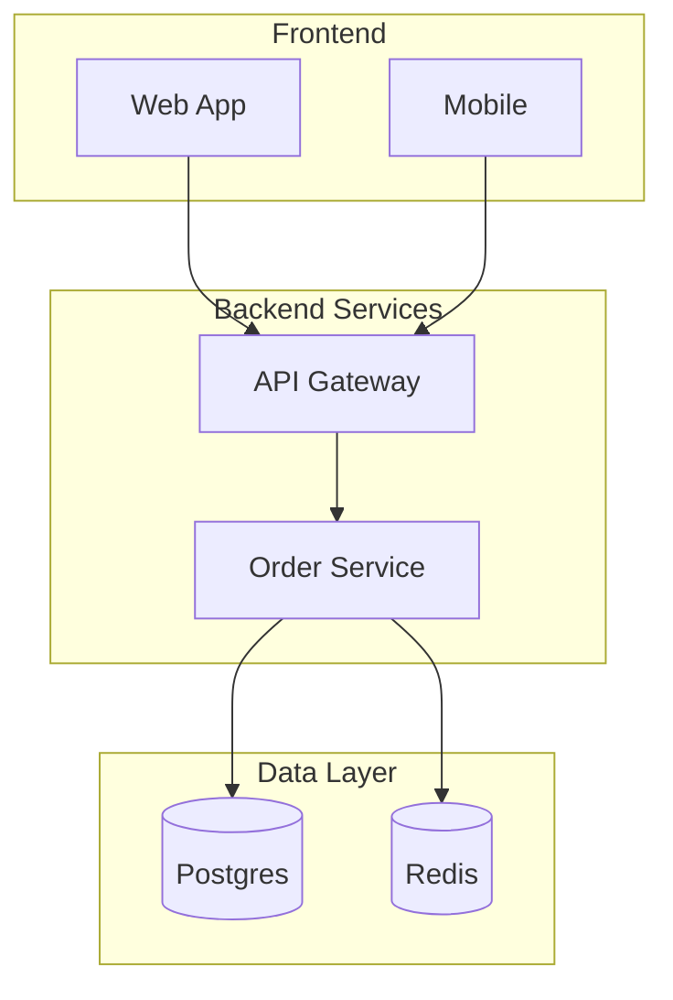
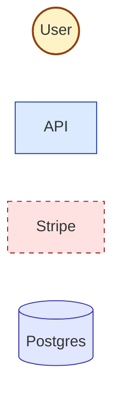
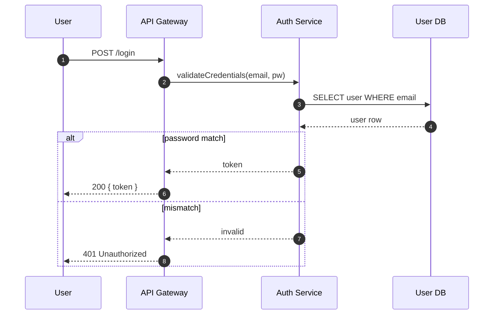
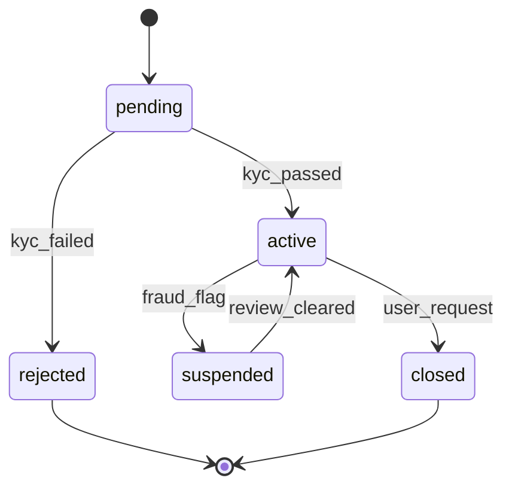
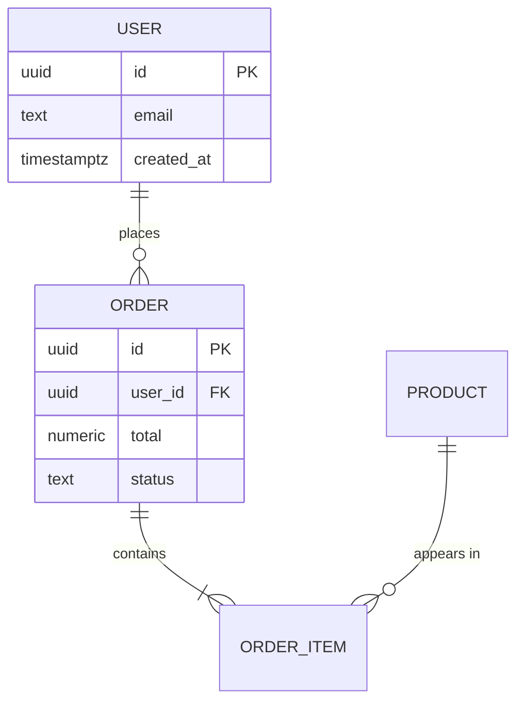
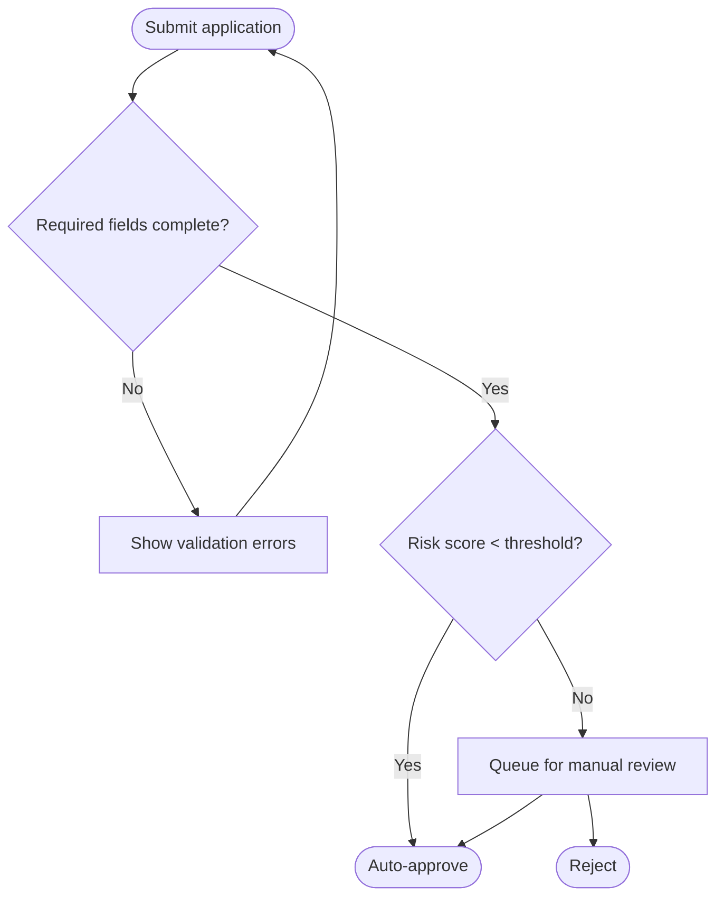

# Mermaid Syntax Cheatsheet

Common patterns and gotchas. Not a full reference — see mermaid.js.org for the spec.

## Theme/init

Always prepend a theme directive so the diagram renders consistently across hosts:

```mermaid
%%{init: {'theme':'neutral'}}%%
```

Use `'neutral'` for documentation. Use `'dark'` only if the host renders on dark backgrounds.

## Subgraphs (use freely, name by layer)



Subgraph IDs are referenced by other diagrams; keep them stable.

## classDef (semantic styling)



Reuse the project's existing palette. Read sibling diagrams before defining new colours.

## Sequence diagram with error path



`autonumber` is helpful for docs that reference steps by number. Use `alt`/`else` for branches; never collapse the failure case into a comment.

## State diagram



Every transition labelled with the **event** that fires it. `[*]` for initial/final.

## ER diagram



Cardinality on every relationship. Field types match project DB dialect.

## Flowchart with decisions



Decision diamonds get `{}`. **Every** edge from a decision is labelled.

## Common gotchas

- **Reserved words**: `end`, `default`, `class`, `state` cannot be used as bare node IDs in some diagram types. Quote them: `node["end"]` or rename.
- **Special chars in labels**: parens, colons, slashes break the parser. Wrap labels in double quotes: `node["Order (paid)"]`.
- **Long labels**: use `<br/>` for line breaks inside labels; `\n` does not work.
- **Edge text with spaces**: `A -->|with text| B` works; `A -- with text --> B` also works. Pick one style per file.
- **Sequence participants**: declare them explicitly at the top in the order you want them to appear, otherwise Mermaid orders by first mention.
- **stateDiagram-v2**, not `stateDiagram`. The legacy syntax has bugs.
- **Direction**: `flowchart TB` (top-bottom) for hierarchies, `LR` for pipelines/value streams. `BT` and `RL` are valid but rarely the right call.
- **Comments**: `%% this is a comment`. Cannot appear inside a node label.
- **Markdown nesting**: when embedding in `.md`, fence with triple backticks and language `mermaid`. GitHub, GitLab, and most renderers honour this.

## Node shapes (flowchart)

| Shape | Syntax | Use for |
|---|---|---|
| Rectangle | `id[Label]` | Default service/process |
| Rounded | `id(Label)` | Soft action |
| Stadium | `id([Label])` | Start/end |
| Subroutine | `id[[Label]]` | Reusable component |
| Cylinder | `id[(Label)]` | Database/store |
| Circle | `id((Label))` | Actor/user |
| Asymmetric | `id>Label]` | Async / event |
| Rhombus | `id{Label?}` | Decision |
| Hexagon | `id{{Label}}` | Preparation step |

Stick to a small set per diagram; visual variety is noise.

## Edge styles (flowchart)

| Style | Syntax | Use for |
|---|---|---|
| Solid | `A --> B` | Synchronous call / hard dependency |
| Dotted | `A -.-> B` | Async / soft dependency |
| Thick | `A ==> B` | Critical path |
| Labelled | `A -->|label| B` | Always for decision branches |
| Bidirectional | `A <--> B` | Two-way handshake (rare) |
