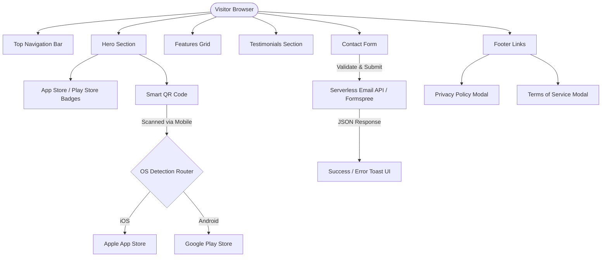

# Rebirth Wallet Landing Page PRD

<!-- epics-index-start -->

## Epics

_Auto-generated index — regenerate with `node scripts/generate-prd-epic-index.mjs`._

| #   | Epic | Status |
| --- | ---- | ------ |
| 165 | [Core Page Shell, Navigation & Footer](epics/epic.165.core-page-shell-navigation-footer/epic.165.core-page-shell-navigation-footer.md) | 📋 Planned |

<!-- epics-index-end -->

## 1. Goals, Background, and Project Analysis

### 1.1 Existing Project Overview
Rebirth Wallet is a non-custodial cryptocurrency and Web3 asset management wallet available on mobile platforms (iOS & Android). This project defines the specification for a high-converting, responsive, production-ready marketing landing page designed to drive app downloads, establish brand trust, collect user inquiries, and fulfill legal compliance requirements.

### 1.2 Available Documentation Analysis
- **Tech Stack Context**: HTML5, Vanilla CSS3 (Custom Properties, Flexbox, Grid), and Vanilla ES6+ JavaScript. No external dynamic frameworks required, ensuring maximum load speed and minimal bundle size.
- **Brand Context**: Premium Web3/crypto fintech aesthetic (dark theme, glassmorphism elements, vibrant gradients, high-contrast typography).

### 1.3 Enhancement Scope Definition
- **Enhancement Type**: New Feature / Marketing Module
- **Enhancement Description**: Build a responsive landing page incorporating top menu, hero section with smart QR code targeting App Store & Google Play, product features, user testimonials, contact form with API integration, footer, and terms/privacy policy modals or pages.
- **Impact Assessment**: Moderate (standalone marketing frontend with low impact on core wallet infrastructure).

### 1.4 Goals and Background Context
- **Primary Goals**:
  1. Maximize mobile app downloads via desktop-to-mobile QR code conversion and direct mobile app store links.
  2. Clearly communicate core product value propositions (security, multi-chain support, ease of use).
  3. Build consumer trust through verified user testimonials and transparent legal documentation.
  4. Enable user and partner communication via a responsive, validated contact form.
- **Background**: Rebirth Wallet requires a dedicated marketing landing page to convert Web traffic into active mobile installations and provide a compliant web presence for app store review guidelines.

### 1.5 Change Log

| Date | Version | Description | Author |
| :--- | :--- | :--- | :--- |
| 2026-09-16 | 1.0.0 | Initial PRD draft created for Rebirth Wallet landing page | create-prd |

---

## 2. Requirements

### 2.1 Functional Requirements (FR)

- **FR1: Top Navigation Bar**
  - Sticky header with Rebirth Wallet logo, navigation links (Features, Testimonials, Contact), and a high-visibility "Download App" CTA button.
  - Mobile responsive hamburger menu drawer for screens under 768px.

- **FR2: Hero Section with Smart QR Code & Store Links**
  - Attention-grabbing headline, subheadline, and key value propositions.
  - Interactive Smart QR Code component: Scanning directs iOS users to Apple App Store and Android users to Google Play Store.
  - Direct download buttons ("Download on App Store" and "Get it on Google Play") with official badges.

- **FR3: Product Features Showcase**
  - Responsive grid layout displaying core wallet capabilities (e.g., Non-Custodial Security, Multi-Chain Support, Instant Swaps, Staking & Yields).
  - High-quality iconography, hover micro-interactions, and concise feature descriptions.

- **FR4: Testimonials Section**
  - Social proof carousel or grid featuring user reviews, star ratings, avatar photos, and verified badge indicators.

- **FR5: Contact Form**
  - Fields: Full Name, Email Address, Subject (General / Support / Partnership), and Message body.
  - Client-side validation for mandatory fields and valid email format.
  - Integration with serverless API endpoint (e.g., Formspree/Resend/custom serverless function) with success/error feedback states.

- **FR6: Footer & Legal Navigation**
  - Footer containing copyright notice, social media icons (Twitter/X, Telegram, Discord, GitHub), navigation sitemap, and legal links.
  - Accessible modal windows or dedicated views for Privacy Policy and Terms of Service.

### 2.2 Non-Functional Requirements (NFR)

- **Performance**:
  - Largest Contentful Paint (LCP) < 1.5 seconds on mobile 4G networks.
  - 100/100 Google Lighthouse score for Performance, Accessibility, and Best Practices.
  - Zero heavy external JavaScript library dependencies.
- **Accessibility**:
  - Full WCAG 2.1 AA compliance: minimum contrast ratio of 4.5:1 for standard text.
  - Complete keyboard navigation support with visible focus rings.
  - Semantic HTML5 structure (`<header>`, `<nav>`, `<main>`, `<section>`, `<footer>`) with appropriate ARIA attributes.
- **Security**:
  - Form submission rate limiting and client-side sanitization against XSS.
  - All outbound links set to `rel="noopener noreferrer"`.
  - Content Security Policy (CSP) compliant asset loading.

### 2.3 Compatibility Requirements (CR)

- **CR1: Cross-Browser & Cross-Device Compatibility**
  - Tested and verified on latest versions of Chrome, Safari, Firefox, Edge, iOS Mobile Safari, and Android Chrome.
  - Responsive design adapting gracefully across screens from 320px up to 4K resolutions.
- **CR2: Fallback Mechanisms**
  - Fallback layout for devices without QR scanner support or JavaScript disabled (`<noscript>` warnings).

---

## 3. UI/UX Design Goals

- **Visual Style**: Dark mode aesthetic (#0B0F19 background) with neon accent gradients (cyan/emerald #00F5D4, indigo #6C5CE7), crisp typography, and subtle glassmorphism cards (`backdrop-filter: blur(12px)`).
- **Hero Focus**: High visual impact with floating app mockup preview adjacent to the interactive QR code card.
- **Micro-Interactions**: Smooth scrolling navigation anchor links, button hover shine effects, and smooth card fade-in on scroll.

---

## 4. Technical Constraints and Integration Requirements

- **Tech Stack**: HTML5, Vanilla CSS3 (using CSS Variables for design tokens), Vanilla ES6+ JavaScript (`app.js` module).
- **Form Service Integration**: Asynchronous `fetch()` payload sent to serverless email gateway endpoint (e.g., Formspree / Resend API endpoint) returning JSON status `{ success: true }`.
- **Assets**: Inline SVGs for crisp scaling of icons, badges, and QR code representation; WebP format for raster images.

---

## 5. Epic List & Complexity Signal Assessment

### Complexity Rubric Assessment
- Domain breadth: 2+ functional areas (Navigation, Marketing showcase, Interactive QR, API form integration, Legal modals)
- Story volume: ~8 stories planned
- Dependency isolation: Form handling and legal pages can be developed independently of Hero section
- **Score: 4/6 signals** -> Multi-Epic breakdown recommended.

### Proposed Epics

1. **Epic 1: Core Page Shell, Navigation & Footer (System Epic 165)**
2. **Epic 2: Hero Section & Smart QR Code App Store Component (System Epic 166)**
3. **Epic 3: Product Features & Testimonials Interactive Grid (System Epic 167)**
4. **Epic 4: Contact Form Service Integration & Legal Modals (System Epic 168)**

---

## 6. Epic Details & User Story Specifications

### Epic 1: Core Page Shell, Navigation & Footer

#### Story 1.1: HTML5 Semantic Layout & Sticky Navigation Header
- **As a** site visitor,
- **I want** a responsive navigation header with quick links and logo,
- **So that** I can easily navigate through the page sections on any device.
- **Acceptance Criteria**:
  1. Sticky top navigation bar with logo, section links, and "Download" CTA button.
  2. Mobile drawer toggles smoothly below 768px viewport width with aria-expanded states.
  3. Smooth scrolling behavior applied to anchor link navigation.
- **Integration Verification (IV)**:
  - IV1: Validate layout across Chrome, Safari, and Mobile Viewports.
- **Estimate**: 2-3 hours.

#### Story 1.2: Footer Sitemap, Social Icons & Copyright Section
- **As a** site visitor,
- **I want** a comprehensive footer with social links and legal references,
- **So that** I can access community channels and legal terms.
- **Acceptance Criteria**:
  1. Footer contains Rebirth Wallet branding, social media links (Twitter, Discord, Telegram, GitHub), and copyright line.
  2. Links include `rel="noopener noreferrer"` attributes.
- **Integration Verification (IV)**:
  - IV1: Verify all social links open in new tabs securely.
- **Estimate**: 1-2 hours.

---

### Epic 2: Hero Section & Smart QR Code App Store Component

#### Story 2.1: Hero Headline & Floating Mobile App Preview
- **As a** prospective user,
- **I want** to see an engaging hero section with headline and app screenshot,
- **So that** I immediately understand Rebirth Wallet's core value proposition.
- **Acceptance Criteria**:
  1. Hero section displays catchy headline, subheadline, and CTA action buttons.
  2. Responsive mockup image showing the Rebirth Wallet mobile UI.
- **Integration Verification (IV)**:
  - IV1: Check LCP score ensuring hero image loads within 1.5s.
- **Estimate**: 2-3 hours.

#### Story 2.2: Dynamic Smart QR Code & App Store Download Badges
- **As a** desktop visitor,
- **I want** to scan a QR code to download Rebirth Wallet on my mobile phone,
- **So that** I can install the app without searching manually in the store.
- **Acceptance Criteria**:
  1. QR Code rendered cleanly using SVG/Canvas pointing to a smart router link or fallback page.
  2. Badges for Apple App Store and Google Play Store displayed with hover states.
- **Integration Verification (IV)**:
  - IV1: Test QR scanning on iOS Camera app and Android Google Lens.
- **Estimate**: 3-4 hours.

---

### Epic 3: Product Features & Testimonials Interactive Grid

#### Story 3.1: Product Features Responsive Cards Grid
- **As a** visitor,
- **I want** to browse key product features (Security, Multi-chain, Swaps, Staking),
- **So that** I can evaluate why Rebirth Wallet is superior.
- **Acceptance Criteria**:
  1. Responsive grid (1 col on mobile, 2 cols on tablet, 4 cols on desktop).
  2. Each card features custom SVG icon, title, description, and hover animation.
- **Integration Verification (IV)**:
  - IV1: Validate keyboard focus states on interactive card elements.
- **Estimate**: 2-3 hours.

#### Story 3.2: User Testimonials Carousel / Social Proof Grid
- **As a** prospective user,
- **I want** to read reviews and ratings from existing wallet users,
- **So that** I feel confident in the safety and reputation of Rebirth Wallet.
- **Acceptance Criteria**:
  1. Cards displaying user avatar, name, handle, 5-star rating, and review text.
  2. Accessible navigation controls for slider/carousel or fallback grid view.
- **Integration Verification (IV)**:
  - IV1: Ensure screen readers announce user testimonials accurately.
- **Estimate**: 2-3 hours.

---

### Epic 4: Contact Form Service Integration & Legal Modals

#### Story 4.1: Contact Form Client-Side Validation & Serverless Submission
- **As a** potential partner or user with questions,
- **I want** to send a message via the contact form,
- **So that** I can reach out to the Rebirth Wallet team.
- **Acceptance Criteria**:
  1. Form fields for Name, Email, Subject, Message.
  2. Client-side regex email validation and empty field checks before dispatch.
  3. `fetch()` POST request to serverless API endpoint showing success message or error toast.
- **Integration Verification (IV)**:
  - IV1: Test successful submission state and network failure error handling.
- **Estimate**: 3-4 hours.

#### Story 4.2: Privacy Policy & Terms of Service Accessible Modals
- **As a** user,
- **I want** to read the Privacy Policy and Terms of Service on the landing page,
- **So that** I understand data privacy practices and usage terms.
- **Acceptance Criteria**:
  1. Modal dialogs for Privacy Policy and Terms of Service triggered from footer links.
  2. Modals capture focus trap (`role="dialog"`, `aria-modal="true"`) and close via Escape key or Close button.
- **Integration Verification (IV)**:
  - IV1: Audit modal keyboard trapping and ESC key dismissal.
- **Estimate**: 2-3 hours.

---

## 7. System Flow & Architecture Diagram

---

## 8. Handoff & Next Steps

### 8.1 UX Expert Handoff Prompt
> "Please review section 3 (UI/UX Design Goals) of the Rebirth Wallet Landing Page PRD (`docs/prd/marketing/prd.rebirth-wallet-landing/prd.rebirth-wallet-landing.md`). Design a high-converting, modern dark-mode landing page wireframe using HTML5/CSS3 CSS Variables with glassmorphism cards, responsive hero layout, interactive QR code box, and accessible modal overlays."

### 8.2 Architect Handoff Prompt
> "Please review the Rebirth Wallet Landing Page PRD located at `docs/prd/marketing/prd.rebirth-wallet-landing/prd.rebirth-wallet-landing.md`. Provide technical implementation guidelines for pure HTML5/Vanilla CSS/ES6 JS static site deployment, serverless form processing integration, and Lighthouse performance optimization."
